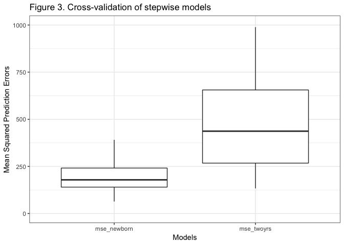
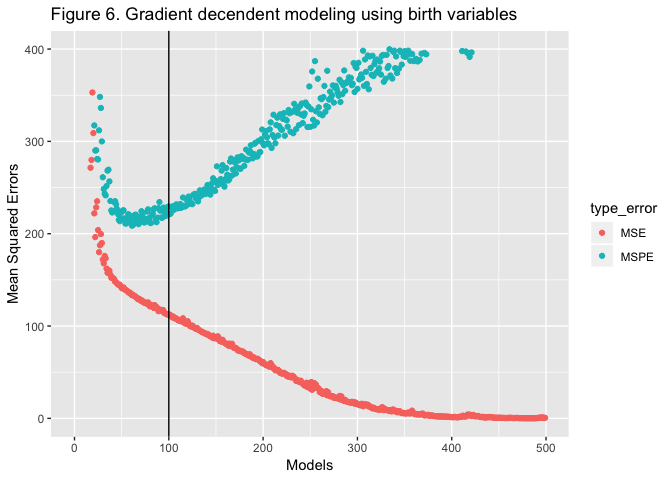
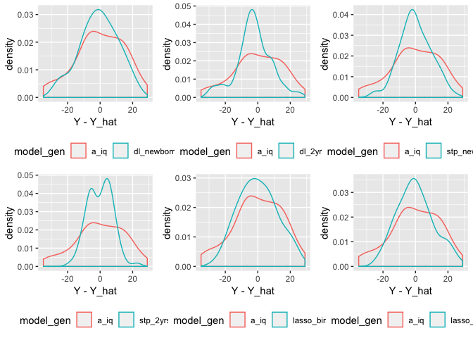

CDH phenotypes
================
Zanis Fang, UID: ZF2213
2/6/2019

### Method

**1. Dealing with missing values.**

There are many missing values in this table. Completeness is different
for values collected at different time
points.

<!-- -->

All variables are relatively complete for the rows with IQ values
collected, indicating a good follow-up in this subgroup.

<!-- -->

I noticed a small peak for variables collected at birth with high
percentage of missing values. It turned out to be “gu\_anomaly”, “clp”,
“need\_neo\_card\_surg”, “sk\_anomalies”, “bps”, “ccam”.

Since all of these variables associate with rare situations. It might be
reasonable to impute the missing values with 0 (or 2 for
need\_neo\_card\_surg).

In this subgroup, the remaining missing values were less severe, so I
imputed these small amount of missing values with the median of
corresponding columns. I’ll do it in the following chunks.

Variables “dead”, “osp\_tracheostomy”, “discharge”, “repaired”,
“SampleID”, “dc\_dead\_age” won’t be used because they are either
single-valued or contribute little to model building.

**2. Prediction methods**

I’ll first try to predict IQ using variables collected at birth because
of the highest completeness. Then I will use variables collected at
either 2-year or at birth to see if it can improve prediction.

The methods I will use are the followin:

  - Backward stepwise linear regression (R step function)
  - Lasso regression (R glmnet package)
  - Sequential neural network (python keras package (in seperate
    document))

**3. Data cleaning**

First, generating table with only variables collected at birth.

When imputing individually with median, the following variables should
be mentioned since they have higher percentage of missing values (more
than 20%):

“hh”, “ph1”, “ph3”, “day\_28\_oxygen”, “hear\_2yr”

**4. Goals**

I aim at modeling with low training errors (Mean Squared Error, MSE)
while keep cross-validation errors low (Mean Squared Prediction Error,
MSPE). I will also show the difference between predicted values and
collected values. R-squared is calculated to show the percentage of
variance in IQ explained by the model.

### Results

*1. Stepwise regression*

Stepwise regression with birth data.

Coefficients and p value for significant variables are listed.

Table 1.

| variable                 |  coefficient |   p.value |
| :----------------------- | -----------: | --------: |
| hh                       |    0.6516988 | 0.0000005 |
| prenatal\_diagnosis2     |  \-9.2108680 | 0.0054355 |
| apgar\_1                 |    1.2860859 | 0.0389058 |
| sys2                     | \-13.1039454 | 0.0703525 |
| bps1                     |   21.8078002 | 0.0018564 |
| newborn\_h\_s\_abnormal2 | \-23.6857493 | 0.0072929 |
| dc\_281                  |   11.4190635 | 0.0076098 |
| day\_28\_oxygen2         |  \-6.5489601 | 0.0333871 |

| r.squared | adj.r.squared |    sigma | statistic | p.value | df |
| --------: | ------------: | -------: | --------: | ------: | -: |
| 0.5795081 |      0.479391 | 10.83155 |  5.788301 |   3e-07 | 16 |

Stepwise regression with 2-year and birth data.

Coefficients and p value for significant variables are listed.

Table 2.

| variable                     |  coefficient |   p.value |
| :--------------------------- | -----------: | --------: |
| race21                       |  \-8.9027596 | 0.0353066 |
| medu1                        |  \-8.4683722 | 0.0282894 |
| hh                           |    0.4639103 | 0.0035555 |
| gender2                      |  \-5.8423282 | 0.0478903 |
| prenatal\_diagnosis2         |  \-6.7624429 | 0.0301729 |
| ht\_z\_birth                 |    4.0799072 | 0.0027308 |
| chd1                         |    8.7632276 | 0.0751708 |
| gi1                          | \-16.0416005 | 0.0786897 |
| sk\_anomalies1               |   22.0695867 | 0.0149443 |
| bps1                         |   16.0897225 | 0.0215274 |
| newborn\_h\_s\_abnormal2     | \-21.2301097 | 0.0129304 |
| day\_28\_oxygen2             |    7.8358834 | 0.0493344 |
| discharge\_oxygen2           |  \-8.1722963 | 0.0848995 |
| waz\_2yr                     |  \-3.2867272 | 0.0119634 |
| headcz\_2yr                  |    3.4208737 | 0.0110770 |
| hosp\_2yr1                   |    6.2550180 | 0.0511617 |
| ther2yr\_any1                | \-11.8419764 | 0.0006373 |
| tube\_2yr1                   | \-17.1598587 | 0.0071276 |
| da\_age                      |    2.1782867 | 0.0055892 |
| da\_lang\_composite\_score   |    0.2870704 | 0.0830738 |
| age\_at\_vine\_ii\_eval      |  \-1.4905857 | 0.0233518 |
| vabs\_com\_stand\_score      |    0.6399698 | 0.0108249 |
| vabs\_dai\_liv\_stand\_score |  \-0.4234547 | 0.0279972 |

| r.squared | adj.r.squared |    sigma | statistic | p.value | df |
| --------: | ------------: | -------: | --------: | ------: | -: |
| 0.7486823 |     0.5738527 | 9.799746 |  4.282353 | 4.1e-06 | 33 |

Cross-validation of the two models

<!-- -->

*2. Lasso regression*

Use cross-validation to determine penalty term lambda for the lasso
regression.

Figure 4. Using birth data.

<!-- -->

| variable                | coefficients |
| :---------------------- | -----------: |
| hh                      |    0.3585232 |
| transfer\_inborn        |    0.6986741 |
| prenatal\_diagnosis     |  \-2.2368729 |
| apgar\_1                |    0.0019289 |
| cns                     |  \-2.0155855 |
| bps                     |    3.4642493 |
| newborn\_h\_s\_abnormal | \-16.1412421 |
| dc\_28                  |    4.1115409 |
| dc\_alive\_age          |  \-0.0489990 |

    ## [1] "r square:"

    ##          s0
    ## s0 0.381596

Figure 5. Using birth and 2-year data.

<!-- -->

| variable                   | coefficients |
| :------------------------- | -----------: |
| hh                         |    0.2897526 |
| transfer\_inborn           |    1.7931202 |
| prenatal\_diagnosis        |  \-2.4160962 |
| cns                        |  \-0.6089839 |
| bps                        |    3.1698078 |
| newborn\_h\_s\_abnormal    | \-14.5778599 |
| dc\_28                     |    3.5915624 |
| dc\_alive\_age             |  \-0.0203986 |
| ther2yr\_any               |  \-3.0255247 |
| da\_lang\_composite\_score |    0.1425487 |
| da\_cog\_composite\_score  |    0.0438073 |
| vabs\_com\_stand\_score    |    0.0529395 |

    ## [1] "r square:"

    ##          s0
    ## s0 0.445856

*3. Deep learning*

Deep learning performance, vertical lines indicate selected
iterations.

<!-- --><!-- -->

### Summary

**1. Distribution of the difference between predicted values (Y\_hat)
and true values (Y) for different models**

dl\_2yrs: deeplearning using 2-year and birth data dl\_newborn:
deeplearning using birth data lasso\_2yrs: lasso regression using 2-year
and birth data lasso\_newborn: lasso regression using birth data
stp\_2yrs: stepwise regression using 2-year and birth data stp\_newborn:
stepwise regression using birth data

**iq\_dist: original IQ distribution centered with mean IQ.**

Figure 8. Distribution of the difference between predicted and true
values

<!-- --><!-- -->

**2. MSE (training bias) MPSE (out-sample bias) and R-squared**

| model               |       rsq |       mse |     mspe |
| :------------------ | --------: | --------: | -------: |
| Stepwise birth      | 0.5738527 |  93.56104 | 178.8134 |
| Stepwise 2-year     | 0.4793910 |  55.91913 | 642.1287 |
| Lasso birth         | 0.3815960 | 137.59722 | 194.3534 |
| Lasso 2-year        | 0.4458560 | 123.29912 | 201.8027 |
| Deeplearning birth  | 0.3831679 | 137.83556 | 229.4835 |
| Deeplearning 2-year | 0.4896157 | 119.50004 | 245.5047 |

### Conclusion

According to Figure 8, all the models slightly out-performed null model
(predict the IQ values with mean IQ). But all the models has higher
out-sample error (MSPE) in comparison with training error (MSE). It is
not confident whether the models would have some prediction values.

I tried to reduce MSPE with regularizers like L2-norm for node weights
and dropout methods in deeplearning and Lasso regression for linear
models but helped little to reduce MSPE.
